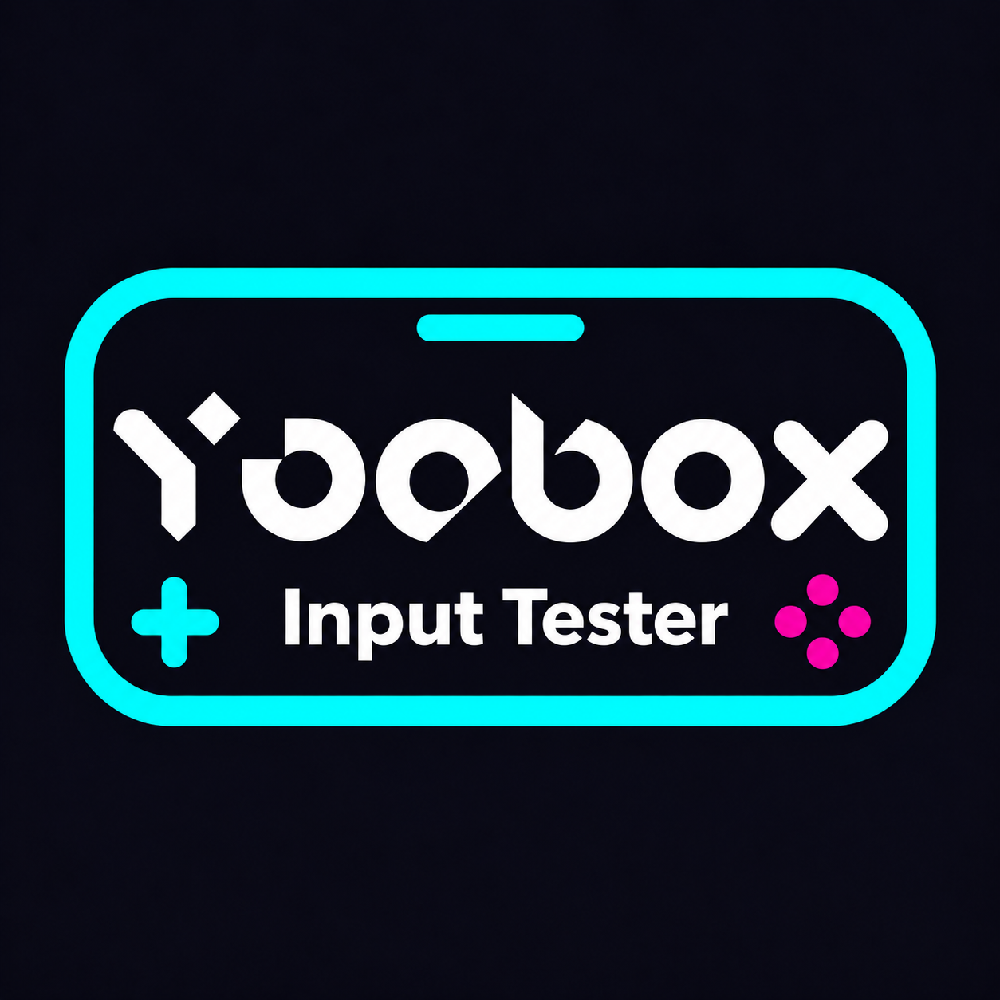

# YooBox Input Tester - SDL2 Demo

<p align="center">
  
</p>

## 项目概述

这是一个基于 SDL2 的 YooBox Y1 掌机输入测试程序，用于检测按键、摇杆和触摸输入。Y1 使用 RK3562 SoC，交叉编译建议使用 ROCKNIX RK3566 aarch64 工具链。

## 硬件规格

- **型号**: YooBox Y1
- **SoC**: Rockchip RK3562（ARM aarch64）
- **屏幕尺寸**: 4.5英寸
- **分辨率**: 1620×1080
- **PPI**: 约450 (计算公式: √(1620² + 1080²) / 4.5 ≈ 450)

## 功能需求

### 1. 窗口设置
- 窗口标题: "YooBox Input Tester"
- 窗口分辨率: 1620×1080
- 全屏或窗口模式可选

### 2. 界面布局
```
┌─────────────────────────────────────┐
│           [LOGO图片]                │  <- 顶部Logo区域
├─────────────────────────────────────┤
│         YooBox Input Tester             │  <- 标题区域
│                                     │
│         [按键显示区域]               │  <- 中央显示区域
│                                     │
└─────────────────────────────────────┘
```

### 3. 输入处理
支持以下输入方式:
- **键盘输入**: 显示按键名称 (如: A, B, Enter, Space等)
- **触摸输入**: 显示触摸坐标 (如: Touch(540, 360))
  光标直接跟随 Touch 的按下、移动和松开坐标，忽略触摸生成的模拟 Mouse 事件，避免从屏幕边缘划回后光标卡住。
  检测到 `play_joystick` 时，事件日志过滤 Mouse 事件，保留 Touch 事件，避免触摸产生重复记录。
- **游戏手柄**: 显示按钮名称 (如: Joystick A, Start等)
  底层输入设备名为 `play_joystick` 时，对调 X/Y 按钮映射，界面高亮和事件日志保持一致；其他手柄使用原映射。
- **鼠标输入**: 移动或点击后，在当前位置显示十字标记，不额外显示光标坐标文字。
- **退出程序**: 同时按住实体 `+`、`SELECT` 和 `START`；页底同时显示中文和英文退出提示。

### ROCKNIX Tools 入口

掌机程序安装在 `/storage/yoobox-input-tester/`。将 `scripts/rocknix-tools/YooBox Input Tester.sh` 复制到 `/storage/.config/modules/` 并赋予执行权限，即可从 Tools 启动。若菜单尚未显示入口，在 EmulationStation 中更新游戏列表。程序退出后返回 Tools。

### 4. 显示逻辑
- 每次输入后刷新显示新的按键值
- 不累加历史记录,只显示最新输入
- 居中显示按键信息

### 5. 视觉风格
采用赛博朋克(Cyberpunk)风格:
- 深色背景 (黑色/深蓝)
- 霓虹色文字 (青色/品红/黄色)
- 发光效果
- 科技感UI元素

## 技术栈

- **SDL2**: 核心图形库
- **SDL2_ttf**: 字体渲染

## 资源文件

```
res/
└── fonts/
    └── font.ttf        # 主字体文件
```

## 字体适配

根据4.5英寸屏幕和450PPI计算:
- 标题字体大小: 48px (物理尺寸约2.7mm)
- 按键显示字体: 36px (物理尺寸约2mm)
- 辅助文字: 24px (物理尺寸约1.3mm)

## 构建说明

```bash
# 创建构建目录
mkdir build && cd build

# 配置
cmake ..

# 编译
make

# 运行
./YooBoxInputTester
```

## Ubuntu 依赖安装指南

### 1. 更新系统包

```bash
sudo apt update && sudo apt upgrade -y
```

### 2. 安装编译工具链

```bash
sudo apt install -y build-essential cmake pkg-config
```

### 3. 安装 SDL2 核心库

```bash
sudo apt install -y libsdl2-dev
```

> 包含: SDL2 头文件、动态库 `libSDL2.so`、静态库

### 4. 安装 SDL2_ttf 字体渲染库

```bash
sudo apt install -y libsdl2-ttf-dev
```

> 包含: TTF 字体渲染支持，用于显示文字

### 5. 一键安装所有依赖

```bash
sudo apt install -y build-essential cmake pkg-config \
    libsdl2-dev libsdl2-ttf-dev
```

### 6. 验证安装

```bash
pkg-config --modversion sdl2
# 输出示例: 2.0.20

pkg-config --modversion SDL2_ttf
# 输出示例: 2.0.18
```

### 7. Wayland 支持（可选）

如果需要 Wayland 显示后端：

```bash
sudo apt install -y libwayland-dev libxkbcommon-dev
```

### 常见问题

| 问题 | 解决方案 |
|------|----------|
| `SDL_Init failed` | 检查是否安装完整，尝试 `export SDL_VIDEODRIVER=x11` |
| 字体不显示 | 确认 `res/fonts/font.ttf` 文件存在 |
| Wayland 不可用 | 程序会自动回退到 X11 |

## 交叉编译指南（Y1 / RK3562，推荐 ROCKNIX RK3566 工具链）

### 硬件与工具链

- **目标设备**: YooBox Y1，Rockchip RK3562，Linux aarch64。
- **推荐工具链**: ROCKNIX 的 RK3566 aarch64 构建工具链。RK3566 是推荐工具链的构建配置名称，Y1 硬件和运行时识别均为 RK3562。
- **工具链目录**: ROCKNIX 构建树中的 `build.ROCKNIX-RK3566.aarch64/toolchain`。
- **编译器前缀**: 默认 `aarch64-rocknix-linux-gnu-`；编译器版本和前缀以实际 SDK 为准。
- **Sysroot**: 默认 `toolchain/aarch64-rocknix-linux-gnu/sysroot`，需要 SDL2 和 SDL2_ttf 头文件与库。

准备 ROCKNIX 构建环境时，参考官方 [Docker 构建指南](https://rocknix.org/contribute/build/#docker-recommended)，使用 RK3566 构建配置准备工具链和依赖。本项目只编译应用程序。

目录示例：

```text
distribution/build.ROCKNIX-RK3566.aarch64/toolchain/
├── bin/
│   ├── aarch64-rocknix-linux-gnu-gcc
│   ├── aarch64-rocknix-linux-gnu-g++
│   └── ...
└── aarch64-rocknix-linux-gnu/sysroot/
    └── usr/
        ├── include/SDL2/
        └── lib/
            ├── libSDL2.so
            └── libSDL2_ttf.so
```

### 编译应用程序

从本仓库根目录执行，路径指向 Linux 构建环境中实际存在的工具链：

```sh
cmake -S . -B build_cross \
  -DCMAKE_TOOLCHAIN_FILE=toolchain.cmake \
  -DTOOLCHAIN_DIR=/path/to/distribution/build.ROCKNIX-RK3566.aarch64/toolchain \
  -DCMAKE_BUILD_TYPE=Release
cmake --build build_cross -j
file build_cross/YooBoxInputTester
# 输出应包含 ELF 64-bit、ARM aarch64
```

`toolchain.cmake` 默认路径为 `$HOME/distribution/build.ROCKNIX-RK3566.aarch64/toolchain`，可通过 `-DTOOLCHAIN_DIR=...` 覆盖。若 SDK 的编译器前缀为 `aarch64-rocknix-linux-gnueabi-`，配置时追加 `-DROCKNIX_TARGET_TRIPLE=aarch64-rocknix-linux-gnueabi`，其 sysroot 目录也须与该前缀匹配。更换工具链时使用新的构建目录，避免复用旧的 CMake 编译器缓存。

使用 ARMv8-A / Cortex-A53 编译选项。交叉构建跳过主机的 pkg-config，依赖直接来自工具链 sysroot。链接所用 SDL2、SDL2_ttf、glibc 等库必须与掌机固件兼容；新工具链若引入掌机不存在的 `GLIBC_*` 符号，应使用与设备固件匹配的 sysroot / 运行库重新构建。

Fn2 ADC 的运行时适配继续检查设备树 `rockchip,rk3562`；工具链名称不影响该硬件检查。

### 部署到目标设备

```bash
# 方法1: 使用 scp 传输
scp YooBoxInputTester user@device:/home/user/

# 方法2: 使用 adb 推送 (Android设备)
adb push YooBoxInputTester /data/local/tmp/

# 方法3: 挂载 NFS 共享目录
cp YooBoxInputTester /nfs_shared/
```

### 在目标设备运行

```bash
# SSH 登录设备后
chmod +x YooBoxInputTester
./YooBoxInputTester
```

### 交叉编译常见问题

| 问题 | 原因 | 解决方案 |
|------|------|----------|
| `SDL2 not found` | pkg-config 找到主机库 | CMakeLists.txt 已处理，交叉编译时跳过 pkg-config |
| `cannot find -lSDL2` | 库路径不正确 | 检查 `CMAKE_SYSROOT/usr/lib` 目录 |
| `undefined reference` | 链接顺序问题 | 确保 SDL2 在 SDL2_ttf 之前链接 |
| 运行时 `No such file` | 动态链接器路径问题 | 设置 `LD_LIBRARY_PATH=/usr/lib` 或使用静态链接 |

### 静态链接（可选）

如需生成静态链接的可执行文件（无需依赖目标设备的 .so 文件）：

```bash
# 需要工具链中有静态库 (.a 文件)
cmake -DCMAKE_TOOLCHAIN_FILE=../toolchain.cmake \
      -DCMAKE_EXE_LINKER_FLAGS="-static" ..
make -j$(nproc)
```

## macOS

在 macOS 上开发本程序的完整流程。注意:原生路径走 `pkg-config`(见 `CMakeLists.txt` 的非交叉分支),
所以需要机器上同时有 `sdl2`、`SDL2_ttf` 两个模块的 `.pc` 文件,缺一个 `cmake` 配置就会失败(它们是 `REQUIRED`)。

### 1. 安装前置工具

```sh
# Xcode 命令行工具(提供 clang / clang++)
xcode-select --install

# Homebrew(如未安装)
/bin/bash -c "$(curl -fsSL https://raw.githubusercontent.com/Homebrew/install/HEAD/install.sh)"

# CMake、pkg-config
brew install cmake pkg-config
```

### 2. 安装 SDL2 依赖

```sh
brew install sdl2_ttf sdl2_image
```

> 注意:Homebrew 里的 `sdl2` 公式近年已由 `sdl2-compat` 取代并提供 `sdl2` 包名(pkg-config 里 Name 是 `sdl2_compat`)。
> 它的 `.pc` 会声明 `-lSDL2main` 却不提供这个库,因此 `CMakeLists.txt` 原生分支特意用
> `list(FILTER _SDL2_LIBS EXCLUDE REGEX "SDL2main")` 把它剔除。**不要删掉这行**,否则会链接失败。

验证依赖是否就位:

```sh
pkg-config --modversion sdl2 SDL2_ttf
```

三个都打印出版本号即可。

### 3. 配置、编译、运行

```sh
# 配置 + 编译(构建产物在 build/)
cmake -S . -B build && cmake --build build -j

# 运行 —— 必须从仓库根目录运行,资源是相对 CWD 加载的(res/fonts/font.ttf 等)
./build/YooBoxInputTester
```

### 4. 已知问题

- **链接告警**:`ld: warning: dylib (...libSDL2*.dylib) was built for newer macOS version (26.0) than being linked (14.0)`
  说明构建的部署目标(默认 14.0)低于 Homebrew 所装 dylib 的版本。功能不受影响,若想消除可在配置时指定更高目标:
  ```sh
  cmake -S . -B build -DCMAKE_OSX_DEPLOYMENT_TARGET=26.0
  ```
- **图形后端**:程序启动时依次尝试 `wayland` → `cocoa` → `x11`(见 `main.cpp` 的 `SDL_setenv("SDL_VIDEODRIVER", ...)` 链)。
  macOS 上没有 wayland/x11,会自然落到 `cocoa`,正常打开窗口。
